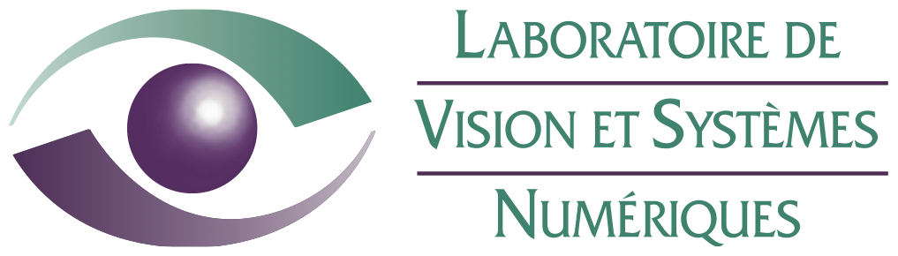
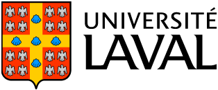

.. image:: _static/deap_long.png
   :width: 300 px
   :align: right
   :target: index.html

About DEAP
==========

Main Contributors
-----------------

In alphabetical order

- `François-Michel De Rainville <https://vision.gel.ulaval.ca/~fmdrainville>`_
- `Félix-Antoine Fortin <https://vision.gel.ulaval.ca/~fafortin>`_
- `Christian Gagné <https://vision.gel.ulaval.ca/~cgagne>`_
- Olivier Gagnon
- Marc-André Gardner
- Simon Grenier
- Yannick Hold-Geoffroy
- Marc Parizeau

DEAP is developed at the `Computer Vision and Systems Laboratory (CVSL) <https://vision.gel.ulaval.ca/>`_ at `Université Laval <http://www.ulaval.ca>`_, in Quebec city, Canada.

Publications on DEAP
--------------------

- Félix-Antoine Fortin, François-Michel De Rainville, Marc-André Gardner, Marc Parizeau and Christian Gagné, "DEAP: Evolutionary Algorithms Made Easy", Journal of Machine Learning Research, pp. 2171-2175, no 13, jul 2012.
- François-Michel De Rainville, Félix-Antoine Fortin, Marc-André Gardner, Marc Parizeau and Christian Gagné, "DEAP: A Python Framework for Evolutionary Algorithms", in EvoSoft Workshop, Companion proc. of the Genetic and Evolutionary Computation Conference (GECCO 2012), July 07-11 2012.

Citation
--------

Authors of scientific papers including results generated using DEAP are
encouraged to cite the following paper.

.. code-block:: latex

     @article{DEAP_JMLR2012, 
         author    = " F\'elix-Antoine Fortin and Fran\c{c}ois-Michel {De Rainville} and Marc-Andr\'e Gardner and Marc Parizeau and Christian Gagn\'e ",
         title     = { {DEAP}: Evolutionary Algorithms Made Easy },
         pages     = { 2171--2175 },
         volume    = { 13 },
         month     = { jul },
         year      = { 2012 },
         journal   = { Journal of Machine Learning Research }
     }
