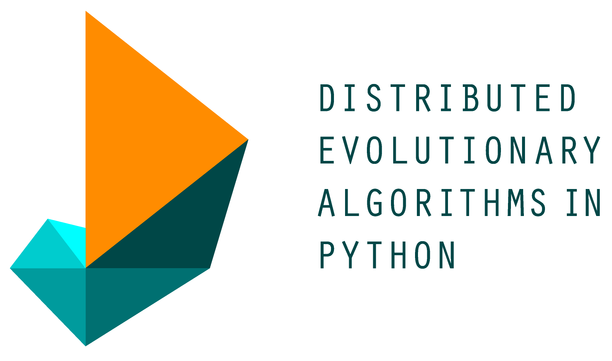

DEAP documentation
==================

DEAP is a novel evolutionary computation framework for rapid prototyping and testing of 
ideas. It seeks to make algorithms explicit and data structures transparent.  It works 
in perfect harmony with parallelisation mechanism such as multiprocessing and `SCOOP
<http://scoop.googlecode.com>`_. The following documentation presents the key concepts
and many features to build your own evolutions.

.. warning::
   
   If your are inheriting from :class:`numpy.ndarray` see the
   :doc:`tutorials/advanced/numpy` tutorial and the
   :doc:`/examples/ga_onemax_numpy` example.

.. sidebar:: Getting Help
    
    Having trouble? We’d like to help!

    * Search for information in the archives of the `deap-users mailing list 
      <https://groups.google.com/forum/?fromgroups#!forum/deap-users>`_,
      or post a question.
    * Report bugs with DEAP in our `issue tracker 
      <https://code.google.com/p/deap/issues/list>`_.

* **First steps:** 

  * :doc:`Overview (Start Here!) <overview>`
  * :doc:`Installation <installation>`
  * :doc:`Porting Guide <porting>`

* **Basic tutorials:**

  * :doc:`Part 1: creating types <tutorials/basic/part1>`
  * :doc:`Part 2: operators and algorithms <tutorials/basic/part2>`
  * :doc:`Part 3: logging statistics <tutorials/basic/part3>`
  * :doc:`Part 4: using multiple processors <tutorials/basic/part4>`

* **Advanced tutorials:**

  * :doc:`tutorials/advanced/gp`
  * :doc:`tutorials/advanced/checkpoint`
  * :doc:`tutorials/advanced/benchmarking`
  * :doc:`tutorials/advanced/numpy`
  
* :doc:`examples/index`

* :doc:`api/index`

* :doc:`releases`

* :doc:`contributing`

* :doc:`about`

.. toctree::
  :hidden:

  overview
  installation
  porting
  tutorials/basic/part1
  tutorials/basic/part2
  tutorials/basic/part3
  tutorials/basic/part4
  tutorials/advanced/gp
  tutorials/advanced/checkpoint
  tutorials/advanced/benchmarking
  tutorials/advanced/numpy
  examples/index
  api/index
  releases
  contributing
  about
