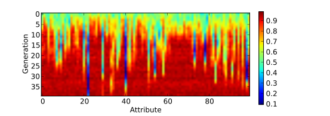

==========
Statistics
==========

.. versionchanged:: 0.2.1b
   There is no more statistics module in EAP. It has been replaced by the use of python's generator expressions and stats functions.

The statistics in EAP are relatively easy to implement in your code. In fact, there is no statistical module in EAP since specialized python projects exist. You are encouraged to use your favorit stats module or the built-in python functions.

Retreiving the information
==========================

The statistic module has been removed since it is really easy and efficient in python to access all the data of the evolutionary algorithm and built a list with it. Every EA is different, with different configurations, different levels of population, different kind of individuals and so on. A module that computes the statistics would have been limited by or would have limit your imagination in a way that it cannot be enough general to cover every single configuration that EAP makes possible.

Accessing the data is made really efficient in python by the list comprehension. Here are some simple examples of evolutionary algorithms and the list comprehension needed to retreive the fitness.

Mono-objective, mono-demic population
-------------------------------------

In this example, we have a single population that contains the individuals, each individual has a fitness. In order to retreive the minimum, maximum and average fitness of the population we may simply use ::

    fits = [ind.mFitness[0] for ind in pop]
    sum2 = sum(imap(lambda x: x**2, fits))
    
    minimum = min(fits)
    maximum = max(fits)
    mean = sum(fits) / len(fits)
    sdev = (sum2 / len(fits) - mean**2)**0.5

Mono-objective, multi-demic population
--------------------------------------

In this example, we have a single population of multiple demes that contains the individuals, each individual has a fitness. In order to retreive the minimum, maximum and average fitness of the population we may simply use ::

    fits = [ind.mFitness[0] for deme in pop for ind in deme]
    sum2 = sum(imap(lambda x: x**2, fits))
    
    minimum = min(fits)
    maximum = max(fits)
    mean = sum(fits) / len(fits)
    sdev = (sum2 / len(fits) - mean**2)**0.5
    
Multi-objective, mono-demic population
--------------------------------------

In this example, we have a single population that contains the individuals, each individual has a many fitnesses. In order to retreive the minimum, maximum and average of each fitness of the population we may simply use ::

    fits = [ind.mFitness for ind in pop]
    fits_t = zip(*fits)        # Transpose the fitnesses
    
    minimums = map(min, fits_t)
    maximums = map(max, fits_t)
    sums = map(sum, fits_t)
    sums2 = [sum(imap(lambda x: x**2, fit)) for fit in a_t]
    means = [sum_ / len(sum_) for sum_ in sums]
    sdevs = [(sum_2 / len(sum_2) - mean**2)**0.5 for sum_2, mean in zip(sums2, means)]

Observing something else
========================

It may be usefull to have some statistics about someting else than the population's fitness. For example, one may need to observe the mean value of each attribute of the individuals. Just as before, it is possible using the generator expressions. ::

    attrs = [ind for ind in pop]
    trans = zip(*attrs)       # Transpose the attributes
    
    sums = map(sum, trans)
    attr_means = [sum_ / len(attrs) for sum_ in sums]
    
`Matplotlib <http://matplotlib.sourceforge.net/>`_ makes it possible to plot the evolution of the attribute's value in function of the generation number. First, we need to create a list where every *mean* produced will be saved. ::

    g_means.append(attr_means)
    
Then, at the end of the evolution (or during the evolution with some more commands), we can draw thoses *averages* with matplotlib's :func:`imshow` function. ::

    plt.figure()
    plt.imshow(g_means)
    plt.colorbar()
    plt.xlabel('Attribute')
    plt.ylabel('Generation')
    plt.show()
    
The above will produce for the One Max example a very impressive look at the propagation of the *ones* in the population. Each row of the graphic is a generation and each column represent the evolution in time of the average value of a specific attribute of the individuals.

    
